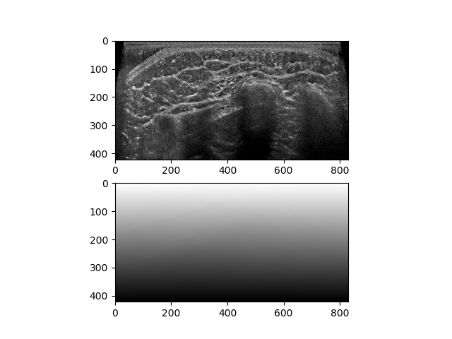
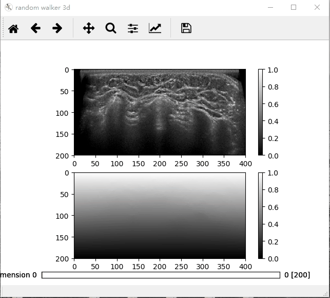
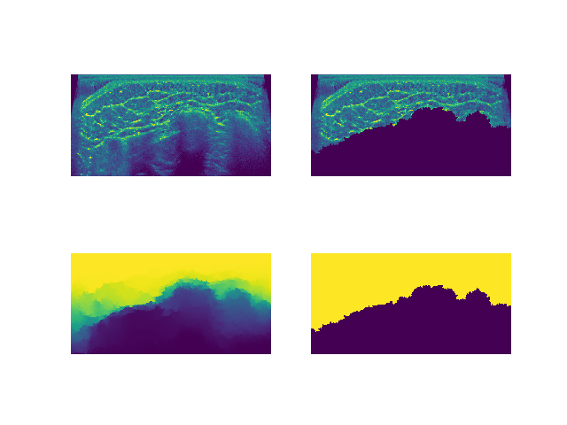
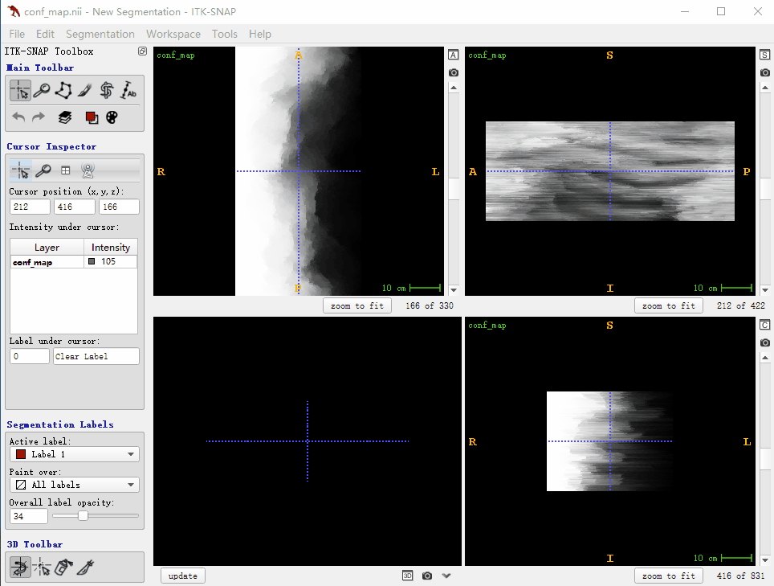
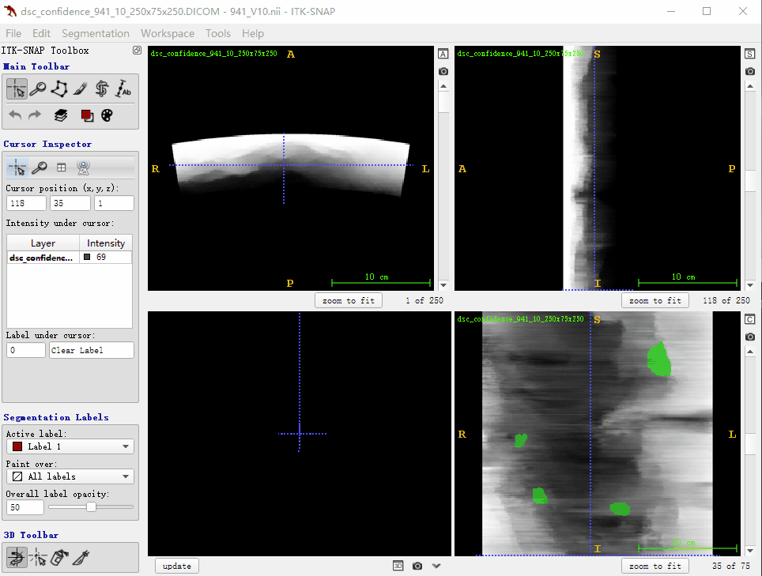

# UltrasondConfienceMap
orienting to ultrasound image,  model ultrasound image quality and decrease detected false positive disease candidate in shadow area
our code refer to the paper of [Karamalis, Athanasios, et al.](https://www.sciencedirect.com/science/article/pii/S1361841512000977), in this paper[^1], author inspired by the random walker, so my implement refer the python code of random walker segmentation in scipy
[^1]可以效率的书写文档

## 2d randolm walks

## 3d random walks

## 2d confidence map

## 3d confidence map

## 3d condidence map decrease false positive tumor candidate
green label is false positive tumor candidate in the shadow of ultrasound image, red is positive tumor candidate.

[^1]:Karamalis A, Wein W, Klein T, et al. Ultrasound confidence maps using random walks[J]. Medical image analysis, 2012, 16(6): 1101-1112.